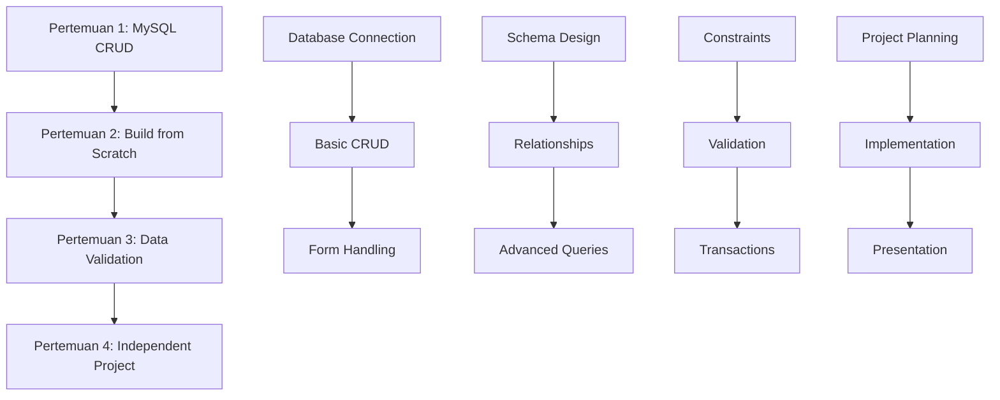

# 🚀 Python Full-Stack: Memahami Sisi Client dan Server Aplikasi

**Program Belajar untuk Siswa SMP: Menguasai Pengembangan Web Client-Server dengan MySQL Database**

---

## 📋 Overview Program

Program pembelajaran ini dirancang khusus untuk siswa SMP yang ingin memahami bagaimana aplikasi web bekerja dari sisi client (frontend) dan server (backend). Melalui 4 pertemuan intensif, siswa akan belajar membangun aplikasi web full-stack dengan MySQL database yang menghubungkan kedua sisi tersebut.

### 🎯 Target Pembelajaran
- **Usia**: Siswa SMP (13-15 tahun)
- **Level**: Intermediate (sudah memahami dasar Python)
- **Durasi**: 4 pertemuan × 2 jam = 8 jam total
- **Fokus**: Memahami arsitektur client-server dalam pengembangan web

---

## 🗂️ Struktur Program

### 📚 [Pertemuan 1: CRUD Operations dengan MySQL](./Pertemuan_1/)
**Tema**: "Mengelola Data Siswa dengan Database MySQL"
- **Praktik**: [`Praktik_Pertemuan_1.py`](./Pertemuan_1/Praktik_Pertemuan_1.py)
- **Materi**: [`Makalah_Pertemuan_1.md`](./Pertemuan_1/Makalah_Pertemuan_1.md)
- **Evaluasi**: [`Quiz_Pertemuan_1.md`](./Pertemuan_1/Quiz_Pertemuan_1.md)

**Yang Dipelajari**:
- ✅ Koneksi Flask dengan MySQL database
- ✅ Operasi CRUD (Create, Read, Update, Delete)
- ✅ Parameterized queries untuk keamanan
- ✅ Error handling untuk database operations
- ✅ Form validation dengan MySQL constraints

---

### 🏗️ [Pertemuan 2: Build from Scratch dengan MySQL](./Pertemuan_2/)
**Tema**: "Membangun Aplikasi Client-Server dengan MySQL Database"
- **Praktik**: [`Praktik_Pertemuan_2.py`](./Pertemuan_2/Praktik_Pertemuan_2.py)
- **Materi**: [`Makalah_Pertemuan_2.md`](./Pertemuan_2/Makalah_Pertemuan_2.md)
- **Evaluasi**: [`Quiz_Pertemuan_2.md`](./Pertemuan_2/Quiz_Pertemuan_2.md)

**Yang Dipelajari**:
- ✅ Database schema design dan normalization
- ✅ Relational database concepts (Foreign Keys)
- ✅ Advanced MySQL queries dengan JOINs
- ✅ Search functionality dengan LIKE operators
- ✅ Data analytics dengan aggregate functions

---

### 🔒 [Pertemuan 3: Validasi Data & Integrasi MySQL](./Pertemuan_3/)
**Tema**: "Memastikan Kualitas Data dengan MySQL Constraints"
- **Praktik**: [`Praktik_Pertemuan_3.py`](./Pertemuan_3/Praktik_Pertemuan_3.py)
- **Materi**: [`Makalah_Pertemuan_3.md`](./Pertemuan_3/Makalah_Pertemuan_3.md)
- **Evaluasi**: [`Quiz_Pertemuan_3.md`](./Pertemuan_3/Quiz_Pertemuan_3.md)

**Yang Dipelajari**:
- ✅ MySQL constraints (UNIQUE, CHECK, NOT NULL)
- ✅ Data validation di Python + MySQL level
- ✅ Transaction management untuk data consistency
- ✅ Backup dan restore database
- ✅ Performance optimization dengan indexing

---

### 🎨 [Pertemuan 4: Proyek Mandiri & Kreativitas](./Pertemuan_4/)
**Tema**: "Wujudkan Ide Kreatifmu dengan MySQL Database"
- **Template**: [`Praktik_Pertemuan_4.py`](./Pertemuan_4/Praktik_Pertemuan_4.py)
- **Panduan**: [`Makalah_Pertemuan_4.md`](./Pertemuan_4/Makalah_Pertemuan_4.md)
- **Evaluasi**: [`Quiz_Pertemuan_4.md`](./Pertemuan_4/Quiz_Pertemuan_4.md)

**Yang Dipelajari**:
- ✅ Independent project development
- ✅ Creative database solutions
- ✅ Complex analytics dan reporting
- ✅ Database-driven web applications
- ✅ Presentation dan documentation skills

---

## 🗄️ Database Setup

### Quick Start MySQL
```sql
-- 1. Buat database
CREATE DATABASE python_fullstack_smp;
USE python_fullstack_smp;

-- 2. Import schema lengkap
source database_setup.sql;

-- 3. Verifikasi setup
SHOW TABLES;
```

📁 **File Setup**: [`database_setup.sql`](./database_setup.sql)
- Schema untuk semua 4 pertemuan
- Sample data untuk latihan
- Views dan stored procedures
- Indexes untuk performance optimization

---

## 🛠️ Tech Stack

### Backend
- **Python 3.8+** - Programming language
- **Flask 2.0+** - Web framework
- **MySQL 8.0+** - Database management system
- **mysql-connector-python** - Database driver

### Frontend
- **HTML5** - Structure
- **CSS3** - Styling
- **Bootstrap 5** - UI framework
- **JavaScript** - Interactivity

### Tools
- **MySQL Workbench** - Database administration
- **VS Code** - Code editor
- **Git** - Version control

---

## 🚀 Getting Started

### Prerequisites
```bash
# Install Python dependencies
pip install flask mysql-connector-python

# Install MySQL Server
# Download dari: https://dev.mysql.com/downloads/mysql/
```

### Setup Database
```bash
# 1. Start MySQL service
# Windows: net start mysql
# macOS: brew services start mysql

# 2. Login ke MySQL
mysql -u root -p

# 3. Run setup script
source database_setup.sql
```

### Run Application
```bash
# Navigate ke folder pertemuan
cd Pertemuan_1

# Run Flask app
python Praktik_Pertemuan_1.py

# Open browser
# http://localhost:5000
```

---

## 📊 Learning Path



---

## 🎯 Learning Outcomes

Setelah menyelesaikan program ini, siswa akan mampu:

### Technical Skills
- ✅ **Client-Side Development**: Memahami HTML, CSS, JavaScript untuk frontend
- ✅ **Server-Side Development**: Membangun backend dengan Python Flask
- ✅ **Database Integration**: Menghubungkan client-server melalui MySQL
- ✅ **API Development**: Membuat endpoint untuk komunikasi client-server
- ✅ **Full-Stack Architecture**: Memahami bagaimana semua komponen bekerja bersama

### Soft Skills
- ✅ **Problem Solving**: Analytical thinking untuk menyelesaikan masalah
- ✅ **Project Management**: Planning dan execution project mandiri
- ✅ **Communication**: Presentasi hasil karya dengan percaya diri
- ✅ **Creativity**: Mengembangkan solusi inovatif dengan teknologi

---

## 📈 Assessment & Evaluation

### Penilaian per Pertemuan
- **Quiz (30%)**: Pemahaman konsep dan teori
- **Praktik (50%)**: Implementation dan coding skills
- **Participation (20%)**: Keaktifan dan collaboration

### Final Project (Pertemuan 4)
- **Database Design (30%)**: Schema quality dan relationships
- **Functionality (30%)**: Working features dan CRUD operations
- **Creativity (25%)**: Innovation dan unique features
- **Presentation (15%)**: Communication dan demo skills

---

## 🎓 Certification

Siswa yang menyelesaikan program ini akan mendapatkan:
- 📜 **Certificate of Completion**: Python Full-Stack Development with MySQL
- 🏆 **Digital Badge**: MySQL Database Developer (Junior Level)
- 📁 **Portfolio Project**: Ready-to-showcase web application

---

## 🤝 Support & Resources

### Getting Help
- 📧 **Email Support**: [instructor@marsanix.com](mailto:instructor@marsanix.com)
- 💬 **Discord Community**: [Join our server](https://discord.gg/marsanix)
- 📚 **Documentation**: Setiap folder memiliki dokumentasi lengkap

### Additional Resources
- 🌐 **MySQL Documentation**: [dev.mysql.com/doc](https://dev.mysql.com/doc/)
- 🐍 **Flask Documentation**: [flask.palletsprojects.com](https://flask.palletsprojects.com/)
- 📖 **Python Tutorial**: [python.org/tutorial](https://docs.python.org/3/tutorial/)

---

## 📝 License & Usage

Program pembelajaran ini dikembangkan oleh **MARSANIX.COM** untuk tujuan edukasi.

- ✅ **Free for Educational Use**: Bebas digunakan untuk pembelajaran
- ✅ **Open Source**: Source code tersedia untuk dipelajari
- ✅ **Community Driven**: Kontribusi dan feedback sangat diterima

---

## 🌟 Success Stories

> *"Program ini mengubah cara saya memandang programming. Sekarang saya bisa membuat aplikasi web yang benar-benar berguna!"*  
> **- Andi, Siswa SMP Kelas 8**

> *"MySQL yang tadinya terlihat rumit, sekarang jadi mudah dipahami. Terima kasih untuk pembelajaran yang praktis!"*  
> **- Sari, Siswa SMP Kelas 9**

---

## 🚀 Ready to Start?

1. **Setup Environment**: Install Python, MySQL, dan dependencies
2. **Clone Repository**: Download semua file pembelajaran
3. **Setup Database**: Run `database_setup.sql`
4. **Start Learning**: Mulai dari Pertemuan 1
5. **Join Community**: Connect dengan fellow learners

**Happy Coding! 🎉**

---

*Dibuat dengan ❤️ oleh Tim MARSANIX.COM untuk masa depan developer Indonesia*